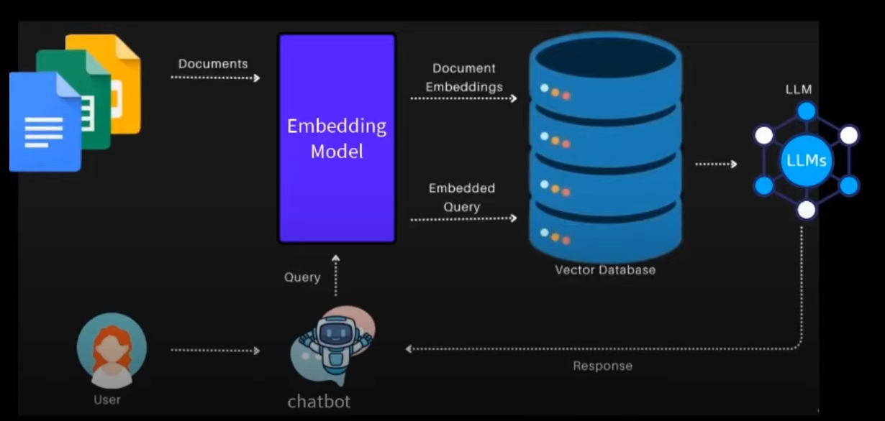

# Custom Chatbot for Any Website

## Project Description

This project focuses on creating a custom AI-powered chatbot for any website. The chatbot extracts data from website pages, converts the text into embeddings using OpenAI's embedding model, and stores them in a vector database. When a user queries the chatbot, it retrieves relevant data using vector search and generates a response with an LLM (Large Language Model).

## Workflow

1. **Extract Website Text**:

   - Fetch all text from website pages by running the `sitemap.xml` command.
   - Gather text from all pages of the website.

2. **Create Embeddings**:

   - Use OpenAI's embedding model to convert the text into vectors.
   - Store these vectors in a vector database like FAISS.

3. **Query Handling**:

   - When a user provides a query, convert the query into an embedding.
   - Use `RetrievalQA.from_chain_type` to interact with the vector database and retrieve relevant information.
   - Generate the response with an LLM using `qa.run(query)`.

## Features

- Extract and process website data from `sitemap.xml`.
- Efficient embedding generation using OpenAI models.
- Vector storage and retrieval with FAISS vector database.
- Seamless integration of query processing with LLMs.
## Architecture:

## Installation

### Prerequisites

 Python 3.8+ installed. Install the required libraries using the following commands:

```bash
pip install langchain langchain-community
pip install pypdf sentence_transformers
pip install openai tiktoken
pip install faiss-cpu unstructured
pip install numpy==1.24.4 nltk==3.9.1
```

## Key Libraries and Tools

- **LangChain**: For building conversational AI pipelines.
- **OpenAI Embedding Model**: For creating text embeddings.
- **FAISS**: For efficient vector storage and retrieval.


